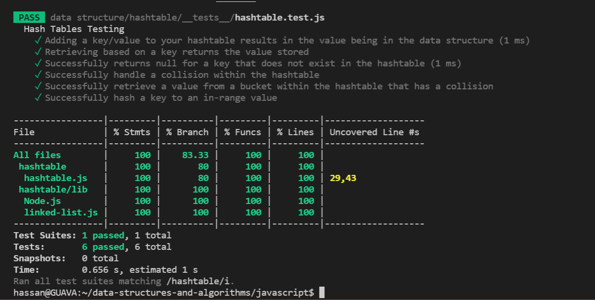

# Singly Linked List

* Implement a HashTable with appropriate tests to verify functionality.

## Challenge

```

Implement a Hashtable Class with the following methods:

add

Arguments: key, value
Returns: nothing
This method should hash the key, and add the key and value pair to the table, handling collisions as needed.

get

Arguments: key
Returns: Value associated with that key in the table

contains

Arguments: key
Returns: Boolean, indicating if the key exists in the table already.

hash

Arguments: key
Returns: Index in the collection for that key

```

 - [x] Top-level README “Table of Contents” is updated
 - [x] README for this challenge is complete
       * [x] Summary, Description, Approach & Efficiency, Solution
       * [x] Picture of whiteboard
       * [x] Link to code
 - [x] Feature tasks for this challenge are completed
 - [x] Unit tests written and passing
       * [x] “Happy Path” - Expected outcome
       * [x] Expected failure
       * [x] Edge Case (if applicable/obvious)
       
       

## Approach & Efficiency :

* add: space O(1)/time O(1)
* hash: space O(1)/time O(1)
* contains: space O(1)/time O(1) - time O(n) if there is a collision
* get: space O(1)/time O(1) - time O(n) if there is a collision


## Test



