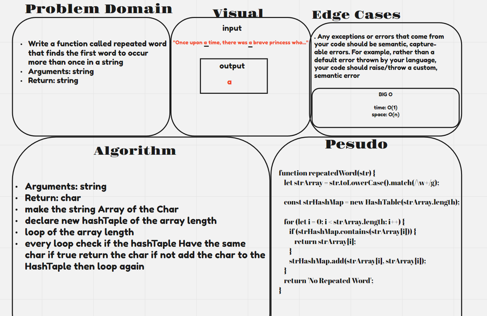
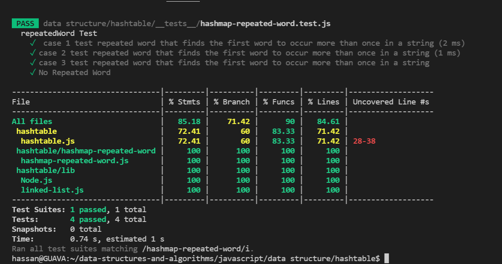

# Repeated Word

## Challenges

```

Write a function called repeated word that finds the first word to occur more than once in a string
Arguments: string
Return: string

```


## Approach & Efficiency

time: O(1)
space: O(n)

## WB :



## Test : 


