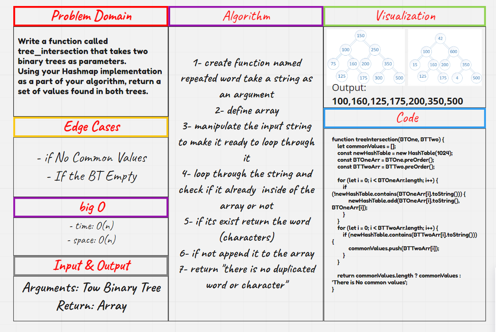
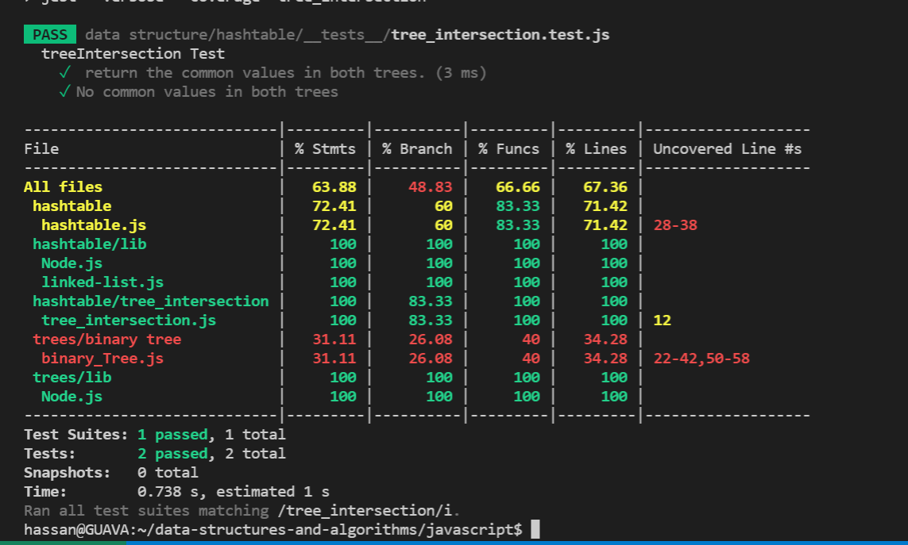

# Tree Intersection

- Find common values in 2 binary trees.

## Challenge

- Write a function called tree_intersection that takes two binary tree parameters.

## Approach & Efficiency
- time: O(n)
- space: O(n)

## WB :

## Test : 

