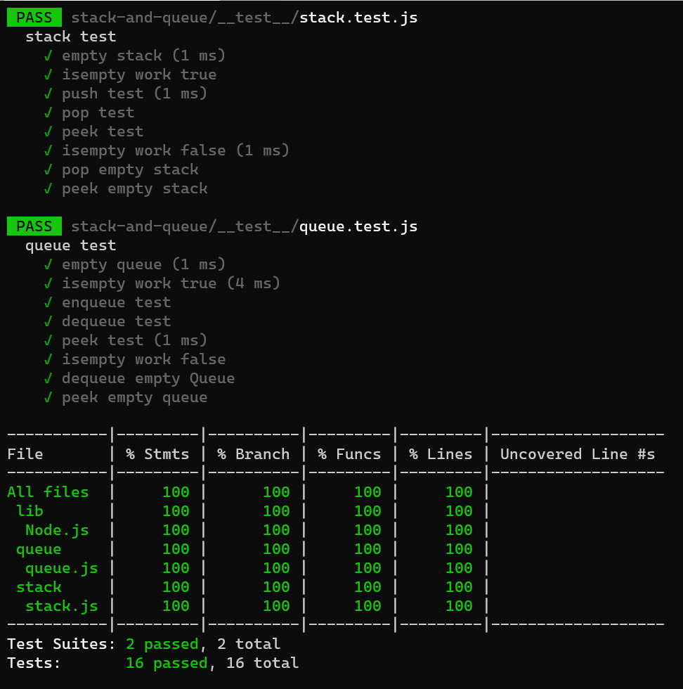

# Stacks and Queues


## Challenge

*Create methods for stacks and queues.*

## API


- The Stack methods:

```

push(value) add a node to the top of the stack
pop() remove a node from the top of the stack. .
peek() return the value for the top of the stack
isEmpty() Checks if a stack is empty.

```

- The Queue methods:

```

enqueue(value) adds a node to the queue.
dequeue() Removes a node from the queue.
peek() return the value for the front of the stack
isEmpty() Checks if a queue is empty.

```


## Approach & Efficiency

- Stacks

```

Push: space O(1)/time O(1)
Pop: space O(1)/time O(1)
Peek: space O(1)/time O(1)
isEmpty: space O(1)/time O(1)

```

- Queues

```

Enqueue: space 0(1)/time O(1)
Dequeue: space 0(1)/time O(1)
Peek: space O(1)/time O(1)
IsEmpty: space O(1)/time O(1)

```

## Testing


* can successfully push onto a stack
* can successfully push multiple values onto a stack
* can successfully pop off the stack
* can successfully empty a stack after multiple pops
* can successfully peek the next item on the stack
* can successfully instantiate an empty stack Calling pop or peek on empty stack raises exception
* can successfully enqueue into a queue
* can successfully enqueue multiple values into a queue
* can successfully dequeue out of a queue the expected value
* can successfully peek into a queue, seeing the expected value
* can successfully empty a queue after multiple dequeues
* can successfully instantiate an empty queue calling dequeue or peek on empty queue raises exception





```


