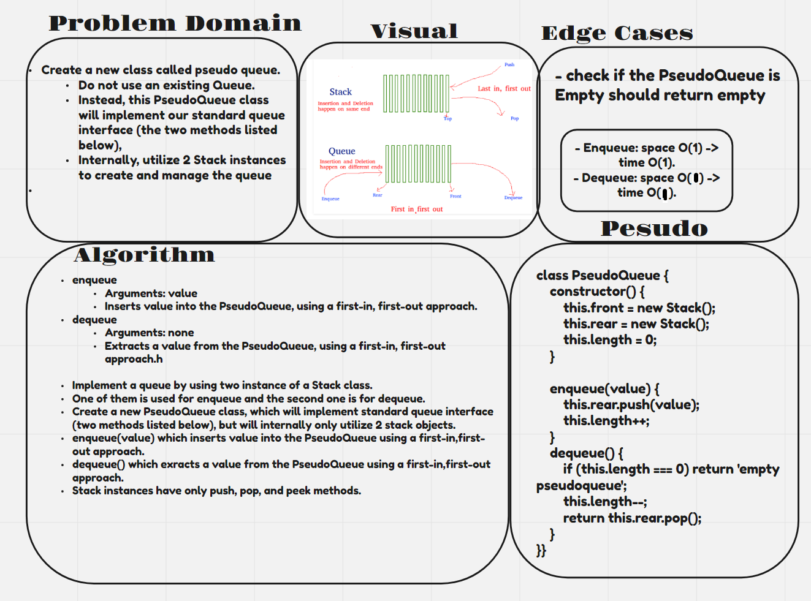

# stack-queue-pseudo

- In this code challenge you are tasked with making a stack and a queue class.

## Approach & Efficiency

- Enqueue: space O(1) -> time O(1).
- Dequeue: space O(1) -> time O(n).

