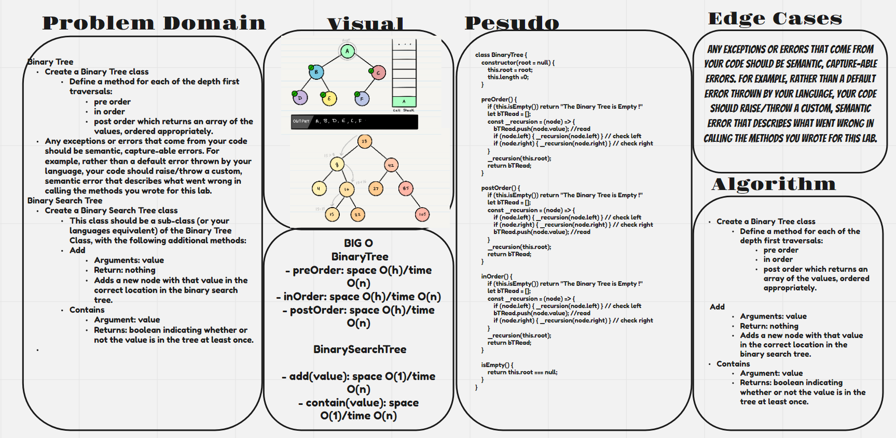
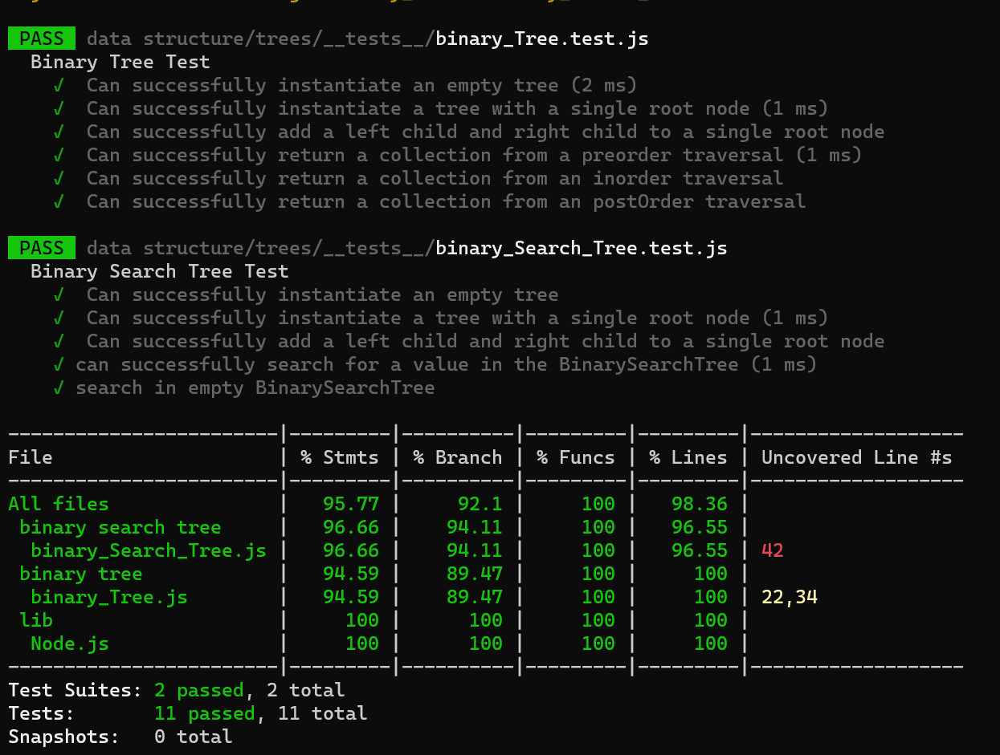
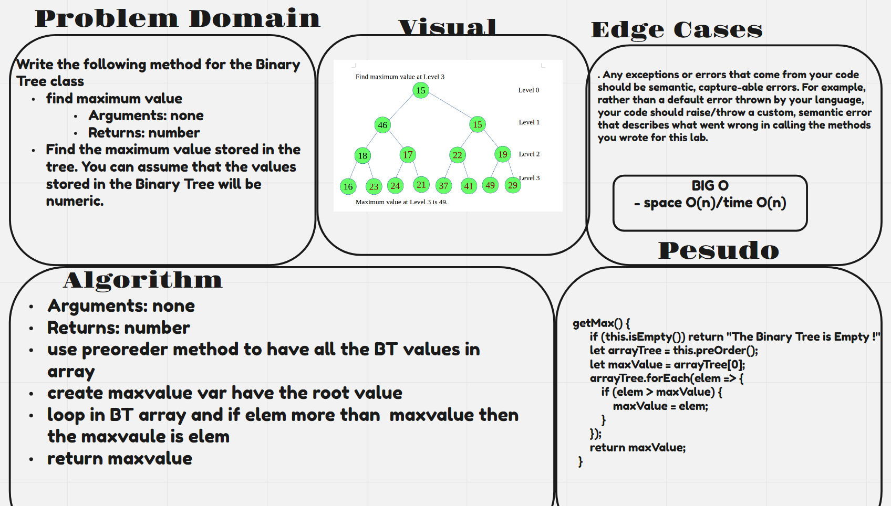
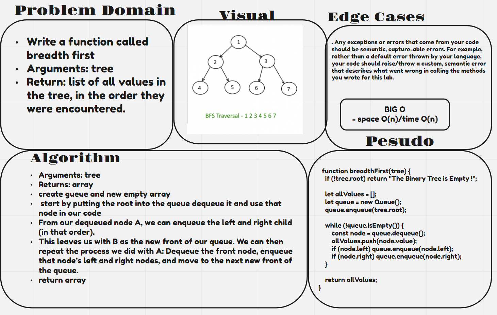
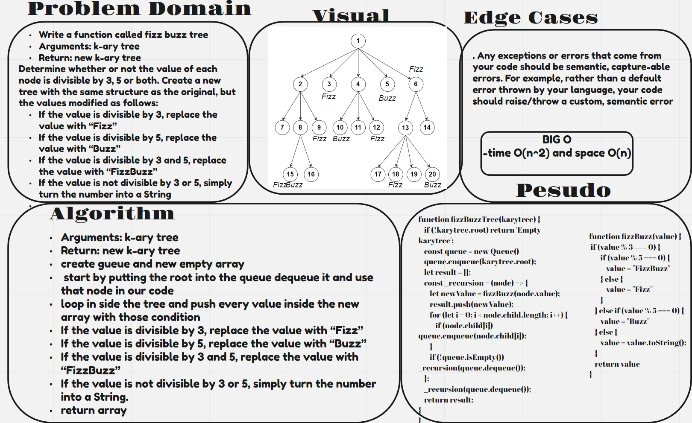

#  Trees

## Challenge

- Node

Create a Node class that has properties for the value stored in the node, the left child node, and the right child node.
- Binary Tree

Create a Binary Tree class
Define a method for each of the depth first traversals:

* pre order
* in order
* post order which returns an array of the values, ordered appropriately.
* Any exceptions or errors that come from your code should be semantic, capture-able errors. For example, rather than a default error thrown by your language, your code should raise/throw a custom, semantic error that describes what went wrong in calling the methods you wrote for this lab.

* Find the maximum value stored in the tree. You can assume that the values stored in the Binary Tree will be numeric.

* Write a function called breadth first return list of all values in the tree, in the order they were encountered.

- Binary Search Tree

* Create a Binary Search Tree class
*This class should be a sub-class (or your languages equivalent) of the Binary Tree Class, with the following additional methods:

* Add

Arguments: value
Return: nothing
Adds a new node with that value in the correct location in the binary search tree.

* Contains

Argument: value
Returns: boolean indicating whether or not the value is in the tree at least once.

## Approach & Efficiency
### BinaryTree

- preOrder: space O(h)/time O(n)
- inOrder: space O(h)/time O(n)
- postOrder: space O(h)/time O(n)
- getMax: space O(n)/time O(n)
- breadth: space O(n)/time O(n)
- fizzBuzzTree time O(n^2) and space O(n)

### BinarySearchTree

- add(value): space O(1)/time O(n)
- contain(value): space O(1)/time O(n)

#### WB :

#### TEST : 

#### Get MAX WB :

#### breadthFirst WB:

#### fizzBuzzTree WB:

