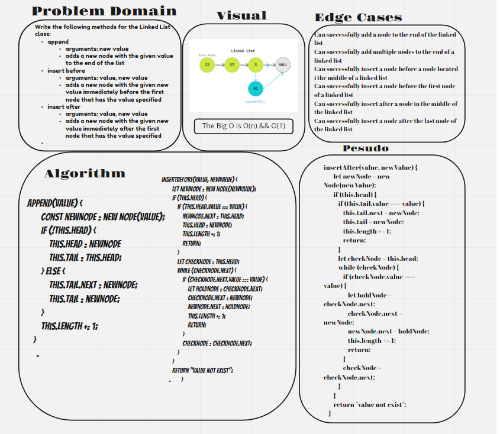
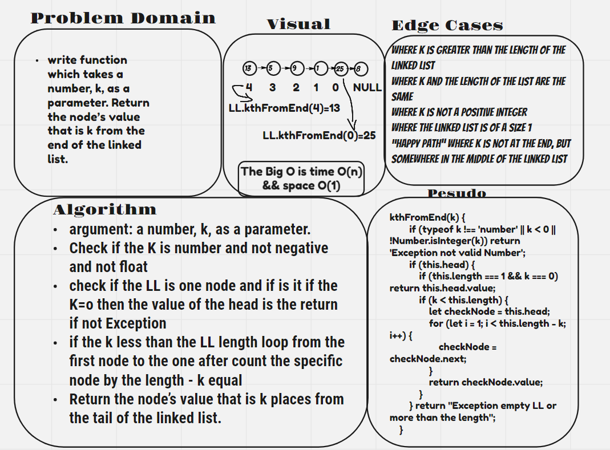
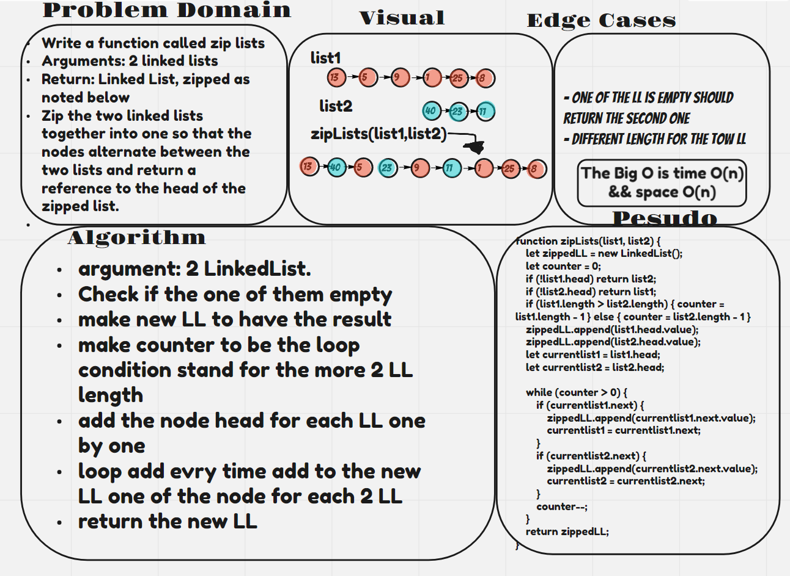

# Singly Linked List

* Creating methods for singly linked lists.

## Challenge

```

Create a Node class that has properties for the value stored int he Node, and a pointer to the next Node.
Within your LinkedList class, include head property.
Upon instantiation, an empty linked list should be created.
Define a method called insert, which takes any value as an argument and adds a new node with that value to the head of the list.
Define a method called includes which takes any value as an argument and returns a boolean result depending on whether that value exists as a node’s value somewhere within the list.
Define a method called toString which takes in no arguments and returns a string representing all the values in the linked list formatted as: { a } -> { b } -> { c } -> NULL

```


- [x]  Can successfully instantiate an empty linked list
- [x] Can properly insert into the linked list
- [x] The head property will properly point to the first node in the linked list
- [x] Can properly insert multiple nodes into the linked list
- [x] Will return true when finding a value within the linked list that exists
- [x] Will return false when searching for a value in the linked list that does not exist
- [x] Can properly return a collection of all the values that exist in the linked list

 - [x] Top-level README “Table of Contents” is updated
 - [x] README for this challenge is complete
       * [x] Summary, Description, Approach & Efficiency, Solution
       * [x] Picture of whiteboard
       * [x] Link to code
 - [x] Feature tasks for this challenge are completed
 - [x] Unit tests written and passing
       * [x] “Happy Path” - Expected outcome
       * [x] Expected failure
       * [x] Edge Case (if applicable/obvious)
       
       

## Big O:
- append 
    * time : O(n)
    * space : O(1)
- insert 
    * time : O(n)
    * space : O(1)
- insertBefore 
    * time : O(n)
    * space : O(1)
- insertAfter 
    * time : O(n)
    * space : O(1)
- toString 
    * time : O(n)
    * space : O(1)
- includes 
    * time : O(n)
    * space : O(1)
- kthFromEnd 
    * time : O(n)
    * space : O(1)
- zipLists 
    * time : O(n)
    * space : O(n)


## Whiteboard Process




- kthFromEnd  UML 



- zipLists UML 


