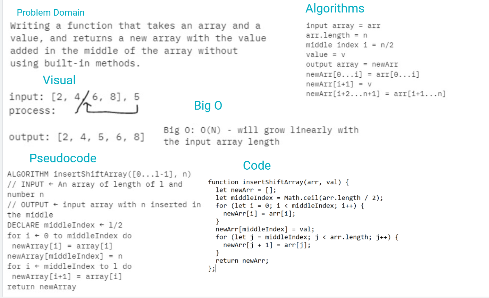

# array-insert-shift

- *Write a function called insertShiftArray which takes in an array and a value to be added. Without utilizing any of the built-in methods available to your language, return an array with the new value added at the middle index.*

## Whiteboard Process



## Approach & Efficiency

```

I split the input array into two divisions, before and after the middle index, then declared a new array, pushing the first division, then the input value, then the second division.

```
