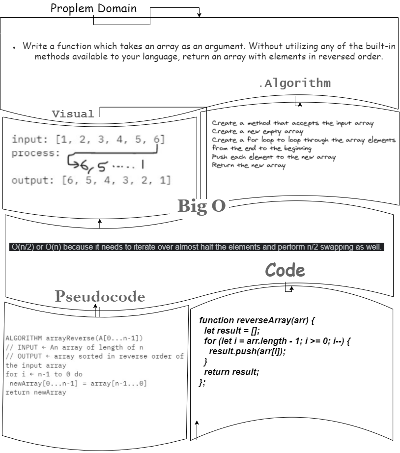

# Reverse an Array

- *Write a function called reverseArray which takes an array as an argument. Without utilizing any of the built-in methods available to your language, return an array with elements in reversed order.*

## Whiteboard Process



## Approach & Efficiency

```

I used a for loop to cycle over the input array, beginning at the last value, and then placing that value into the results array. The second to last value is then pushed into the results array. The first thing that sprang to me was to use a for loop, and it seemed like a simple way to go about it.

```
