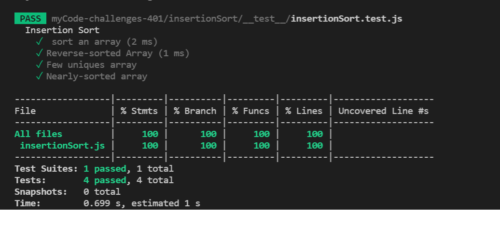
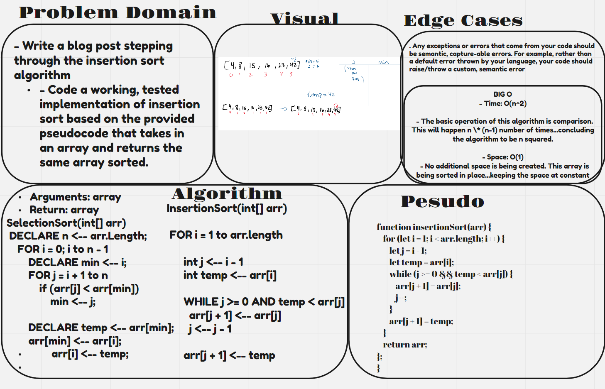

# Insertion Sort

**Insertion sort is a sorting algorithm that traverses a part of an array many times as it slowly builds up the sort sequence. The traversal tracks the current value and compares it with all the values ​​to its left, if the current value is less than the value to its left, the two values ​​are swapped. This will result in an incrementally ordered array.**

## Challenge

- Write a blog post stepping through the insertion sort algorithm
- Code a working, tested implementation of insertion sort based on the provided pseudocode that takes in an array and returns the same array sorted.

## Approach & Efficiency

- 
- Time: O(n^2)

  - The basic operation of this algorithm is comparison. This will happen n \* (n-1) number of times…concluding the algorithm to be n squared.

- Space: O(1)
  - No additional space is being created. This array is being sorted in place…keeping the space at constant O(1).

  * TEST : 

  

  * WB : 

  

