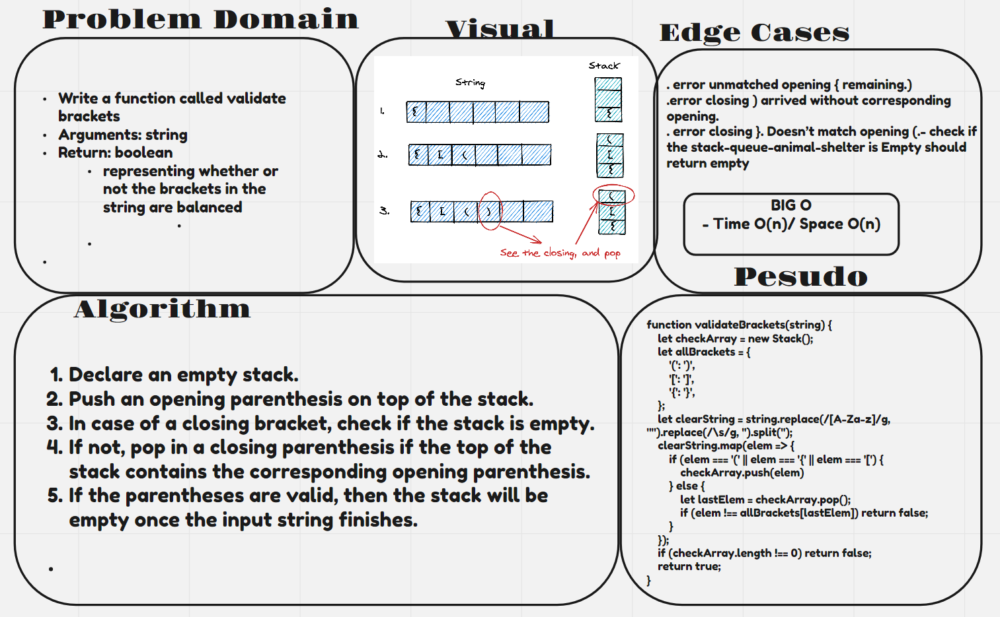

# validate brackets

## Challenge

```
Write a function called validate brackets
Arguments: string
Return: boolean
representing whether or not the brackets in the string are balanced
```

## Approach & Efficiency

- Time O(n)/ Space O(n)

## UML 



